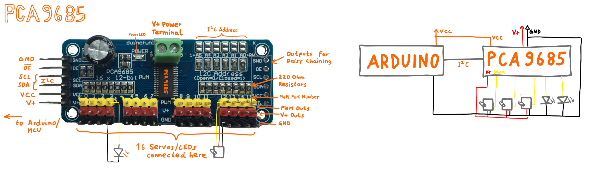
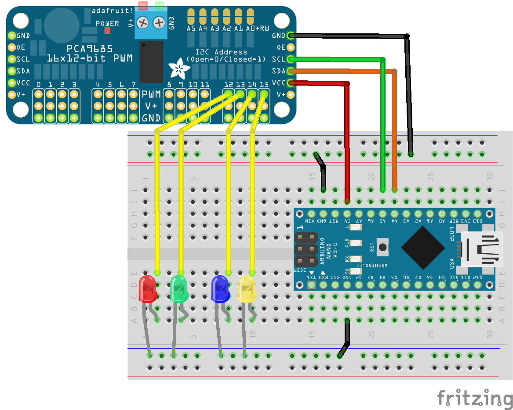
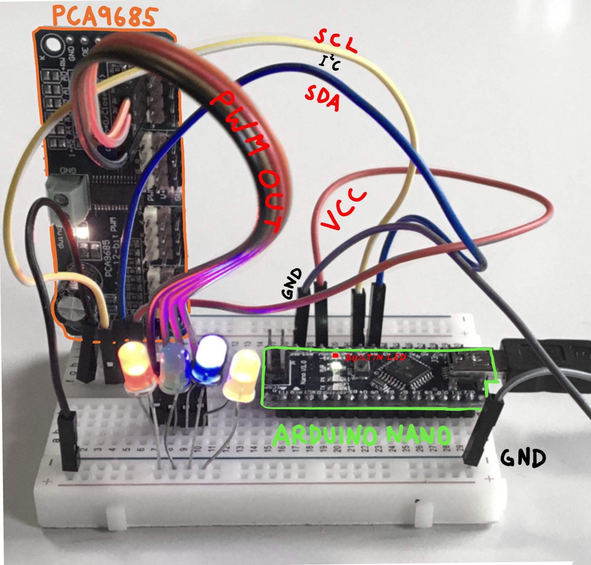

# jled-pca9685-hal

[](https://github.com/jandelgado/jled-pca9685-hal/actions/workflows/test.yml)

A hardware abstraction layer (HAL) for th
[JLed](https://github.com/jandelgado/jled) library to use PCA9685 PWM drivers
to control LEDs over I2C.

<!-- vim-markdown-toc GFM -->

* [PCA9685](#pca9685)
* [How to use](#how-to-use)
* [Demo](#demo)
* [Dependencies](#dependencies)
* [Author](#author)
* [License](#license)

<!-- vim-markdown-toc -->

## PCA9685

The [PCA9685](https://learn.adafruit.com/16-channel-pwm-servo-driver?view=all)
is an **I2C bus** controlled LED/Servo controller **with 16 individually
controllable PWM channels**. Each channel has a resolution of 12 bits,
resulting in 4096 steps. All channels operate at the same fixed frequency,
which must be in the range between 24Hz and 1526Hz.



The board operates at 3V to 5V, which is fed through the VCC pin. The V+ pin
is optional and is used to power servos or LEDs with up to 6V. The V+ voltage
can also be fed through the green terminal block and is routed to the red V+
pins.

Each of the yellow PWM outputs on the board has a 220 Ohms resistor in series,
which allows the direct connection of a LED. The output level is the same as
VCC.

SDA and SCL are the I2C data and clock pins. The OE pin is optional (and pulled
down by default) and is used to quickly disable all outputs (by setting OE to
high level).

The I2C address is by default `0x40` and can be changed by closing the `A0` to
`A5` pins using a soldering iron.

## How to use

This library exposes two classes:

* `jled::PCA9685Hal` - the Hardware Abstraction Layer for JLed for the PCA9685
* `jled::JLedPCA9685` - for convenience, a JLed for the the PCA9685Hal HAL is also provided

To use it, we first need to create a `TwoWire` instance for the I2C communication
and then an instance of the `Adafruit_PWMServoDriver` class to control the 
PCA9685:

```c++
constexpr auto I2C_ADDRESS = 0x40;  // I2C address of the PCA9685 board
auto i2c = TwoWire();
auto pwm = Adafruit_PWMServoDriver(I2C_ADDRESS, i2c);

auto led = jled::JLedPCA9685(jled::PCA9685Hal(15, &pwm)).Blink(250, 750).Forever();

void setup() {
    pwm.begin();
}

void loop() {
    led.Update();
}
```

To simplify the construction of the `jled::JLedPCA9685` objects, the 
[demo](examples/demo/demo.ino) uses a helper:

```c++ 
constexpr auto I2C_ADDRESS = 0x40;
auto i2c = TwoWire();
auto pwm = Adafruit_PWMServoDriver(I2C_ADDRESS, i2c);

jled::JLedPCA9685 JLedPCA9685(jled::PCA9685Hal::PinType pin) {
    return jled::JLedPCA9685(jled::PCA9685Hal(pin, &pwm));
}
```

The construction then simplifies to

```c++
auto led12 = JLedPCA9685(12).Breathe(2000).Forever();
```

## Demo

The [demo](examples/demo/demo.ino) shows how to connect some LEDs to a PCA9685
and controls these LEDs with an Arduino Nano. Additionally, the builtin LED 
of the Arduino is also controlled by a JLed instance using the Arduino HAL. 

<p float="left">
    
    
</p>

## Dependencies

When using this library with PlatformIO, the dependencies are automatically
resolved according to [library.properties](library.properties). Just add
`lib_deps = JLedPCA9685-HAL` to your `platformio.ini` file.

In the Arduino-IDE the dependencies must be configured manually. Make sure to
add:

* JLedPCA9685-HAL (this library)
* [JLed](https://github.com/jandelgado/jled)
* [Adafruit PWM Servo Driver Library](https://github.com/adafruit/Adafruit-PWM-Servo-Driver-Library)

in The Library Manager of the Arduino IDE, or manually run 

```shell
$ arduino-cli lb install JLedPCA9685-HAL
$ arduino-cli lb install JLed
$ arduino-cli lb install "Adafruit PWM Servo Driver Library"
```

Additionally the [Arduino Wire
library](https://www.arduino.cc/reference/en/language/functions/communication/wire/)
for the I2C communication is being used, wich is available by default in the
Arduino Framework.

## Author

(C) Copyright 2022 by Jan Delgado

## License

MIT

