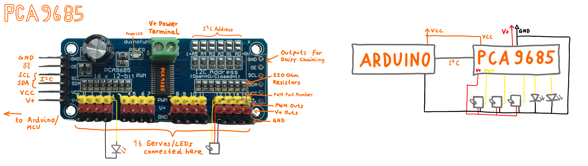
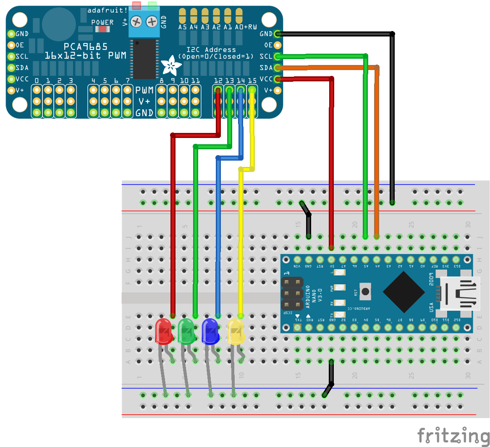
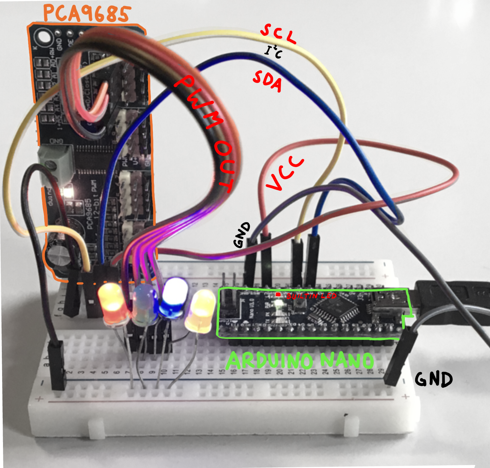

# jled-pca9685-hal

[](https://github.com/jandelgado/jled-pca9685-hal/actions/workflows/test.yml)

A hardware abstraction layer (HAL) for the
[JLed](https://github.com/jandelgado/jled) (V5) library to use [PCA9685 PWM
drivers](https://learn.adafruit.com/16-channel-pwm-servo-driver?view=all) to
control LEDs over I2C.

<!-- vim-markdown-toc GFM -->

- [PCA9685](#pca9685)
- [How to use](#how-to-use)
- [Demo](#demo)
- [Dependencies](#dependencies)
- [Author](#author)
- [License](#license)

<!-- vim-markdown-toc -->

## PCA9685

The PCA9685 is an **I2C bus** controlled LED/Servo controller **with 16
individually controllable PWM channels**. Each channel has a resolution of 12
bits, resulting in 4096 steps. All channels operate at the same fixed
frequency, which must be in the range between 24Hz and 1526Hz. JLed Version 5
supports high resolution effects and can use the whole 12-bit range for smooth long
running fade effects.



The board operates at 3V to 5V, which is fed through the VCC pin. The V+ pin
is optional and is used to power servos or LEDs with up to 6V. The V+ voltage
can also be fed through the green terminal block and is routed to the red V+
pins.

Each of the yellow PWM outputs on the board has a 220 Ohms resistor in series,
which allows the direct connection of a LED. The output level is the same as
VCC.

SDA and SCL are the I2C data and clock pins. The OE pin is optional (and pulled
down by default) and is used to quickly disable all outputs (by setting OE to
high level).

The I2C address is by default `0x40` and can be changed by closing the `A0` to
`A5` pins using a soldering iron.

## How to use

This library exposes three classes:

- `jled::PCA9685Hal` - the Hardware Abstraction Layer for JLed for the PCA9685
- `jled::JLedPCA9685` and `jled::JLedPCA9685HD` - for convenience, JLed classed
  with 8-bit and 12-bit resolution for the PCA9685Hal HAL are also provided

To use it, we first need to create an instance of the `Adafruit_PWMServoDriver` class, using the
board's default I2C bus (`Wire`), to control the PCA9685:

```c++
constexpr auto I2C_ADDRESS = 0x40;  // I2C address of the PCA9685 board
auto pwm = Adafruit_PWMServoDriver(I2C_ADDRESS, Wire);

auto led = jled::JLedPCA9685(15, &pwm).Blink(250, 750).Forever();

void setup() {
    pwm.begin();
}

void loop() {
    led.Update();
}
```

`jled::JLedPCA9685` also accepts a pre-constructed `jled::PCA9685Hal`, e.g.
for cases where a custom HAL is needed:

```c++
auto led = jled::JLedPCA9685(jled::PCA9685Hal(15, &pwm)).Blink(250, 750).Forever();
```

## Demo

The [demo](examples/demo/demo.ino) shows how to connect multiple LEDs to a PCA9685 and controls
these LEDs with an Arduino Nano. The example also shows a `JLedPCA9685` and `JLedPCA9685HD` with
long running breathe effects side-by-side, which allows to observe the effect of 8-bit and 12-bit
PWM resolution especially at the beginning and the end of the effect run. Additionally, the builtin
LED of the Arduino is also controlled by a JLed instance using the Arduino HAL. All LEDs
are controlled together using a `JLedRefGroup` in parallel.

The demo's [platformio.ini](platformio.ini) also includes environments to build and run the demo
on an ESP32 (`esp32`) or a Raspberry Pi Pico (`raspberrypi_pico`); select one by uncommenting the
corresponding `default_envs` line.

<p float="left">
    
    
</p>

```c++
// Use JLed to control LEDs using a PCA9685 I2C PWM controller.
#include <Wire.h>
#include <jled-pca9685-hal.h>

// initialize the pwm driver, using the board's default I2C bus (Wire).
// I2C_ADDRESS may vary among PCA9685 boards.
constexpr auto I2C_ADDRESS = 0x40;
auto pwm = Adafruit_PWMServoDriver(I2C_ADDRESS, Wire);

// led_builtin is using the platforms HAL and drives the builtin LED
auto led_builtin = JLed(LED_BUILTIN).Blink(500, 500).Forever().LowActive();

// these LEDs use the PCA9685 HAL and drive leds through the I2C bus
// the HD version leverages full 12-bit resolution of the PCA9685 PWM, the others operate
// with 8-bit effect and PWM resolution. Watch carefully led12 and led13 side-by-side,
// the difference is visible.
auto led12 = jled::JLedPCA9685HD(12, &pwm).Breathe(15000).DelayAfter(500).Forever();
auto led13 = jled::JLedPCA9685(13, &pwm).Breathe(15000).DelayAfter(500).Forever();
auto led14 = jled::JLedPCA9685(14, &pwm).FadeOff(1000).Forever();
// equivalent, explicit HAL construction, e.g. for a custom PCA9685Hal
auto led15 = jled::JLedPCA9685(jled::PCA9685Hal(15, &pwm)).Blink(250, 750).Forever();

// construct a JLedRefGroup to control all LEDs in parallel.
JLedRef leds[] = { &led_builtin, &led12, &led13, &led14, &led15 };
auto group = JLedRefGroup::Parallel(leds);

void setup() {
    pwm.begin();
}

void loop() {
    group.Update();
}
```

## Dependencies

This library depends on [Adafruit PWM Servo Driver
Library](https://github.com/adafruit/Adafruit-PWM-Servo-Driver-Library) and, of course
[JLed](https://github.com/jandelgado/jled).

### PlatformIO

When using this library with PlatformIO, the dependencies are automatically resolved according to
[library.properties](library.properties). Just add `lib_deps = jandelgado/JLedPCA9685-HAL@^5.0.0` to your
`platformio.ini` file.

### Arduino IDE

In the Arduino IDE's Library Manager, add this library as a dependency:

- `JLedPCA9685-HAL` (this library, choose latest version 5) and confirm to install dependent
  libraries

Alternatively, you can run:

```shell
$ arduino-cli lib install JLedPCA9685-HAL@5.0.0
$ arduino-cli lib install JLed@5.0.0
$ arduino-cli lib install "Adafruit PWM Servo Driver Library"@3.0.3
$ arduino-cli lib install "Adafruit BusIO"@1.16.2
```

Additionally the [Arduino Wire
library](https://www.arduino.cc/reference/en/language/functions/communication/wire/) for the I2C
communication is being used, which is available by default in the Arduino Framework.

## Author

(C) Copyright 2022-2026 by Jan Delgado

## License

MIT
